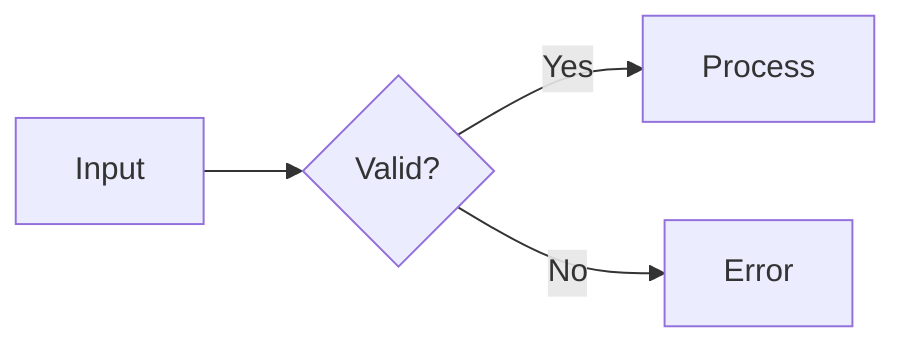

# Claude Style Markdown Preview

VS Code 마크다운 프리뷰를 Claude Code의 터미널 미감(모노스페이스 + 따뜻한 오렌지 액센트)으로 바꿔주는 확장. Mermaid 다이어그램과 라이트/다크 토글을 함께 제공한다.

## Features

- **모노스페이스 타이포그래피** — 에디터 폰트를 그대로 사용해 본문 전체가 Claude Code 톤으로 정렬
- **다크/라이트 자동 적응** — 기본은 VS Code 테마를 따라가되, 우상단 토글로 강제 전환 가능
- **Auto / Light / Dark 토글** — 클릭으로 순환, 선택은 `localStorage`에 저장
- **Mermaid 다이어그램** — `flowchart`, `sequence`, `class`, `state`, `er`, `gantt`, `pie`, `journey`, `gitGraph`, `mindmap`, `timeline`, `quadrant`, `C4`, `sankey` 등 모두 로컬 번들로 렌더
- **에러 핸들링** — 잘못된 mermaid 문법은 한 줄짜리 에러 박스 + 원본 소스로 표시 (잔여 SVG 누적 없음)
- **테마 변경 시 자동 재렌더** — mermaid SVG가 새 테마 색상으로 다시 그려짐

## Install

### VSIX로 설치 (배포본)

[Releases 페이지](https://github.com/ibank/claude-style-markdown-preview/releases)에서 `.vsix` 다운로드 후:

```bash
code --install-extension claude-style-markdown-preview-*.vsix
```

또는 VS Code: **Extensions** → `⋯` → **Install from VSIX...**

### 소스에서 직접 (개발용)

```bash
git clone https://github.com/ibank/claude-style-markdown-preview.git
cd claude-style-markdown-preview

VERSION=$(node -p "require('./package.json').version")
ln -sfn "$(pwd)" "$HOME/.vscode/extensions/ibank.claude-style-markdown-preview-$VERSION"
```

이후 `Cmd+Shift+P` → **Developer: Reload Window**.

## Usage

1. 마크다운 파일 열기
2. `Cmd+Shift+V` (또는 `Cmd+K V`) 로 프리뷰
3. 우상단 알약 버튼으로 테마 토글: **◐ Auto → ☀ Light → ☾ Dark**

### Mermaid 예시

````markdown

````

지원 다이어그램 전체 목록은 [`test.md`](test.md) 참고.

### JS API

webview 콘솔에서 직접 제어 가능:

```js
claudeMdTheme.getMode();          // 'auto' | 'light' | 'dark'
claudeMdTheme.setMode('dark');    // 강제 설정
claudeMdTheme.getEffectiveTheme(); // 'light' | 'dark'
```

## Customization

색상 톤은 [`styles/claude.css`](styles/claude.css) 상단 CSS 변수만 바꾸면 된다.

```css
:root {
  --claude-orange: #d97757;       /* 액센트 */
  --claude-orange-soft: #e8a87c;  /* 다크모드 링크/마커 */
  --claude-orange-deep: #b85a35;  /* 라이트모드 링크/마커 */
}

body.vscode-dark { --md-bg: #1a1a1a; ... }
body.vscode-light { --md-bg: #faf9f7; ... }
body.claude-force-dark { ... }    /* 토글로 강제 다크 */
body.claude-force-light { ... }   /* 토글로 강제 라이트 */
```

저장 후 프리뷰 새로고침(`Cmd+Shift+P` → "Markdown: Refresh Preview")이면 즉시 반영.

## Project Structure

```
claude-style-markdown-preview/
├── package.json              # 확장 매니페스트
├── styles/
│   └── claude.css            # 본문 + 토글 버튼 + mermaid 컨테이너 스타일
├── scripts/
│   ├── theme-toggle.js       # 토글 버튼 + 강제 테마 클래스 적용
│   ├── mermaid.min.js        # Mermaid v10.9.1 UMD 번들 (3.2MB)
│   └── mermaid-init.js       # 블록 탐지 + 렌더 + 테마 변경 시 재렌더
├── test.md                   # 동작 확인용 샘플
└── README.md
```

## How It Works

### 스타일 주입

`package.json`의 `contributes.markdown.previewStyles`로 CSS를 마크다운 프리뷰 webview에 주입. VS Code 기본 스타일 뒤에 로드되므로 자연스럽게 오버라이드된다.

### 스크립트 주입

`contributes.markdown.previewScripts`로 JS 파일을 webview에 `<script>` 태그로 주입. 로딩 순서:

1. `theme-toggle.js` — body에 `claude-force-*` 클래스를 미리 붙여서 깜빡임 방지
2. `mermaid.min.js` — `globalThis.mermaid` 노출
3. `mermaid-init.js` — DOM 스캔, 블록 탐지, 렌더

### Mermaid 블록 탐지

두 가지 셀렉터로 탐지:

1. `pre > code.language-mermaid` — markdown-it 기본 출력
2. `pre > code` 본문이 `flowchart`, `sequenceDiagram` 등으로 시작 — syntax highlighter가 클래스를 덮어쓴 경우 폴백

### Render 안전장치

- `mermaid.parse()` 로 사전 검증 → 문법 오류 시 `render()` 호출 자체를 안 함 (mermaid가 `<body>`에 잔여 SVG 남기는 동작 방지)
- 그래도 남은 잔여물은 `cleanupOrphans()` 가 매 렌더 사이클마다 청소

### 테마 전환

- 토글 클릭 → body 클래스 갱신 → CSS 변수 즉시 재정의 → 본문 전체 색상 전환
- `claude-theme-change` 커스텀 이벤트 발생 → mermaid-init이 수신 → 저장된 원본 소스(`data-mermaid-source`)로부터 SVG 재렌더

### 본문 재렌더 대응

VS Code는 마크다운 편집 시 `<body>` 내부를 다시 그린다. `MutationObserver`가 새 `pre/code`를 감지하고 자동으로 mermaid 재렌더, 토글 버튼/강제 클래스도 재부착.

## Distribution

### 1) 로컬 `.vsix` 빌드

```bash
cd claude-style-markdown-preview
npx --yes @vscode/vsce package --no-dependencies
# → claude-style-markdown-preview-<version>.vsix 생성 (~1MB)
```

### 2) 다른 사람에게 전달 / 직접 설치

```bash
# 받은 사람:
code --install-extension claude-style-markdown-preview-*.vsix
# 또는 VS Code UI: Extensions → ⋯ → "Install from VSIX..."
```

### 3) VS Code Marketplace 발행 (선택)

마켓플레이스에 올리려면 **publisher 등록**이 선행돼야 한다.

1. https://marketplace.visualstudio.com/manage 에서 publisher 생성 (현재 `package.json`의 `publisher` 값과 일치시킬 것)
2. Azure DevOps에서 Personal Access Token (PAT) 발급
   - Organization: All accessible
   - Scope: **Marketplace → Manage**
3. 로그인 후 발행:

```bash
npx vsce login <publisher-name>   # PAT 입력
npx vsce publish --no-dependencies # 또는 vsce publish patch / minor / major
```

### 4) Open VSX (Cursor/VSCodium 사용자 대상)

```bash
npx ovsx publish --no-dependencies -p <ovsx-token>
```

토큰은 https://open-vsx.org/user-settings/tokens 에서 발급.

## License

MIT — 자유롭게 사용.
