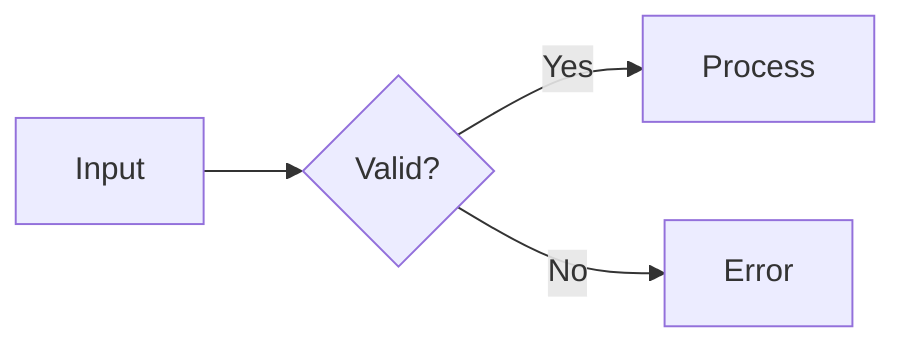

# Claude Style Markdown Preview

VS Code 기본 마크다운 프리뷰를 Claude 스타일로 바꿔 주는 확장이다. 세리프
헤딩, 깔끔한 산세리프 본문, 모노스페이스 코드, 따뜻한 오렌지 액센트,
라이트/다크 팔레트를 적용한다. Mermaid 다이어그램, 구문 강조, GitHub 스타일
알림 블록, 플로팅 목차도 함께 제공한다.

## Features

- **하이브리드 타이포그래피**: 헤딩은 Source Serif 4, 본문은 Source Sans 3,
  코드는 JetBrains Mono. 한글은 번들된 Pretendard로 표시된다.
- **Auto / Light / Dark**: 우상단 세그먼트 컨트롤. Auto는 High Contrast를
  포함해 VS Code 테마를 따르고, 선택한 값은 기억된다.
- **구문 강조**: 주요 36개 언어는 Claude 톤 팔레트로 강조한다. 그 밖의
  언어는 VS Code가 강조한 결과를 같은 팔레트로 표시한다.
- **코드 블록**: 언어 라벨과 Copy 버튼이 붙는다.
- **Mermaid 다이어그램**(Mermaid 11 번들): flowchart, sequence, class, state,
  ER, Gantt, pie, journey, git graph, mindmap, timeline, quadrant, XY,
  sankey, block, packet, architecture, kanban, C4 등. 다이어그램마다 확대/축소,
  SVG 복사, 전체화면 보기(드래그로 이동, 휠·핀치로 확대)를 지원한다.
- **알림 블록**: GitHub 스타일 `> [!NOTE]`, `[!TIP]`, `[!IMPORTANT]`,
  `[!WARNING]`, `[!CAUTION]`과 `[!DANGER]`.
- **목차**: `##`–`####` 헤딩으로 만드는 플로팅 패널. 읽고 있는 섹션을
  강조한다.
- **헤딩 링크**: 헤딩에 마우스를 올리고 ¶를 누르면 `#section` 링크가
  복사된다.
- **이미지**: 클릭하면 크게 보인다. 이미지만 있는 문단은 alt 텍스트가
  캡션으로 붙는다.
- **페이지 확대/축소**: `Cmd/Ctrl` + `+` / `-` / `0`, 또는 `Cmd/Ctrl` +
  스크롤·핀치.
- 읽기 진행 막대, 인쇄 스타일, 모션 줄이기 설정 지원.

## 설치

- **Marketplace**: 확장 보기에서 *Claude Style Markdown Preview*를 검색하거나
  `code --install-extension ibank.claude-style-markdown-preview`를 실행한다.
- **VSIX**: [Releases 페이지](https://github.com/ibank/claude-style-markdown-preview/releases)에서
  `claude-style-markdown-preview-*.vsix`를 받은 뒤
  `code --install-extension claude-style-markdown-preview-*.vsix`를 실행하거나
  **Extensions** → `⋯` → **Install from VSIX...**를 사용한다.

VS Code 1.95 이상이 필요하다. 설정할 것은 없고, 기본 프리뷰에 바로 적용된다.

## 사용법

1. `.md` 파일을 연다.
2. `Cmd+Shift+V` / `Ctrl+Shift+V`로 프리뷰를 열거나, `Cmd+K V` / `Ctrl+K V`로
   옆에 연다.
3. 우상단 **Auto · Light · Dark**에서 테마를 고른다. 그 아래 ☰ 버튼은 목차를
   연다(섹션이 두 개 이상인 문서에서 나타난다).

### Mermaid

````markdown

```mermaid
flowchart LR
    A[Input] --> B{Valid?}
    B -->|Yes| C[Process]
    B -->|No| D[Error]
```
````

문법 오류가 있는 ` ```mermaid ` 블록은 소스 위에 오류 메시지를 표시한다.
언어를 지정하지 않은 블록은 첫 줄이 Mermaid 헤더(`graph TD`,
`sequenceDiagram` 등)이고 파싱에 성공할 때만 다이어그램으로 그리며, 그렇지
않으면 코드 블록으로 둔다. 모든 기능의 예시는 [`test.md`](test.md)에 있다.

### JavaScript API

프리뷰 개발자 도구(**Developer: Open Webview Developer Tools**)에서:

```js
claudeMdTheme.getMode();           // 'auto' | 'light' | 'dark'
claudeMdTheme.setMode('dark');     // 모드 강제
claudeMdTheme.getEffectiveTheme(); // 'light' | 'dark'
claudeMdZoom.setZoom(1.25);        // 125%
claudeMdZoom.reset();
```

## 커스터마이즈

색상은 CSS 변수(`--md-*`)로 정의되어 있다. VS Code의 `markdown.styles` 설정에
추가한 스타일시트에서 덮어쓰면 된다. 이 스타일시트는 확장 스타일 뒤에
로드되고, 확장을 업데이트해도 유지된다.

```jsonc
// settings.json
"markdown.styles": [".vscode/preview.css"]
```

```css
/* .vscode/preview.css. data-claude-theme은 실제로 표시 중인 테마다. */
body[data-claude-theme="dark"]  { --md-accent: #7aa2f7; --md-link: #7aa2f7; }
body[data-claude-theme="light"] { --md-accent: #3b5bdb; --md-link: #3b5bdb; }
```

자주 쓰는 변수는 `--md-bg`, `--md-text`, `--md-heading`, `--md-accent`,
`--md-link`, `--md-code-bg`, `--md-inline-code-fg`, 구문 강조 색상
`--md-hl-*`이다. 전체 목록은 [`styles/claude.css`](styles/claude.css) 상단에
있다.

## 보안과 개인정보

- 다이어그램은 Mermaid `securityLevel: 'antiscript'`로 렌더링되어 라벨의
  `<script>` 태그와 이벤트 핸들러가 제거된다. 이 과정은 VS Code 프리뷰의
  Content Security Policy 안에서 실행된다.
- Mermaid, highlight.js, Pretendard 폰트는 번들되어 있다. 라틴 폰트(Source
  Sans 3, Source Serif 4, JetBrains Mono)는 Google Fonts에서 받는다. 이 요청이
  차단되거나 오프라인이면 시스템 폰트를 쓴다. 텔레메트리는 없다.
- `localStorage`에는 테마 선택과 확대 비율만 저장한다.

보안 문제는 저장소에 이슈로 알려 주면 된다.

## 동작 방식

확장 호스트 코드는 없다. `markdown.previewStyles`와
`markdown.previewScripts`로 VS Code 기본 프리뷰에 스타일시트 하나와 스크립트
여섯 개를 추가할 뿐이다.

| 파일 | 역할 |
|---|---|
| `styles/claude.css` | 모든 스타일. VS Code 테마 클래스별, 강제 모드별 테마 변수 |
| `scripts/theme-toggle.js` | Auto/Light/Dark 컨트롤, 강제 테마 클래스, `claude-theme-change` 이벤트 |
| `scripts/page-zoom.js` | 프리뷰 전체 확대(`<body>`의 `zoom`)와 배지 |
| `scripts/enhance.js` | 헤딩 링크, 코드 크롬과 구문 강조, 알림 블록, 이미지, 목차, 진행 막대 |
| `scripts/mermaid-init.js` | 다이어그램 블록 탐지, 카드와 전체화면 보기 렌더링 |
| `scripts/highlight.min.js` | highlight.js 11.12 (주요 언어) |
| `scripts/mermaid.min.js` | Mermaid 11.17 (`mermaid` 전역 정의) |

VS Code는 프리뷰 스크립트를 `async`로 로드하므로, 어느 스크립트도 다른
스크립트가 먼저 실행됐다고 가정하지 않는다.

**편집 중 갱신.** VS Code는 편집할 때마다 렌더링된 HTML을 morphdom으로 제자리
갱신한 뒤 `vscode.markdown.updateContent` 이벤트를 발생시킨다. 이 갱신은
요소에 추가한 확장 요소를 지우는데, 두 강화 스크립트가 이 이벤트에서
동기적으로(다음 페인트 전에) 다시 적용한다. 요소를 감싸거나 교체하지 않고
VS Code가 만든 요소를 그대로 고친다. 코드 크롬은 `<pre>` 안에 들어가고,
다이어그램 카드는 해당 블록의 `<pre>` 자체다. 그래서 갱신 시 요소가 1:1로
매칭되어, 펼친 `<details>`가 닫히지 않고 긴 문서도 빠르게 갱신된다. 렌더링한
다이어그램은 테마와 소스별로 캐시해 두므로, 바뀌지 않은 다이어그램은 다시
그리지 않는다.

**테마 전환.** 토글은 `<body>`에 `claude-force-light` 또는
`claude-force-dark`를 붙여 변수를 다시 정의한다. 표시 중인 테마가 토글이나
VS Code 때문에 바뀌면 `theme-toggle.js`가 `data-claude-theme`을 갱신하고
`claude-theme-change`를 발생시키며, 다이어그램이 새 테마로 다시 그려진다.

## 프로젝트 구조

```
claude-style-markdown-preview/
├── package.json              # 매니페스트 (contribution만, `main` 없음)
├── styles/claude.css         # 스타일과 테마 변수
├── scripts/                  # 위에서 설명한 프리뷰 스크립트 여섯 개
├── fonts/                    # Pretendard Variable (한글)
├── test.md                   # 수동 QA용 샘플 (패키지에 미포함)
├── CHANGELOG.md · LICENSE · THIRD_PARTY_NOTICES.md
└── README.md · README.ko.md
```

## 개발

VS Code에서 폴더를 열고 `F5`(**Run Extension**)를 누르면 [`test.md`](test.md)가
열린 Extension Development Host가 뜬다. 파일을 고친 뒤에는 그 창에서
**Developer: Reload Window**를 실행한다.

`.vsix` 빌드(약 3 MB, 대부분 Mermaid와 한글 폰트):

```bash
npx @vscode/vsce package --no-dependencies
```

`v*` 태그를 푸시하면 [`release.yml`](.github/workflows/release.yml)이 VSIX를
빌드해 GitHub Release에 첨부한다. 저장소 시크릿 `VSCE_PAT`, `OVSX_PAT`이
설정되어 있으면 VS Code Marketplace와 Open VSX에도 게시한다. 직접 게시하려면:

```bash
npx @vscode/vsce publish --no-dependencies            # Marketplace PAT 필요
npx ovsx publish --no-dependencies -p <open-vsx-token>
```

## License

[MIT](LICENSE) — © 2026 ibank

번들된 서드파티 코드와 폰트: [THIRD_PARTY_NOTICES.md](THIRD_PARTY_NOTICES.md)
