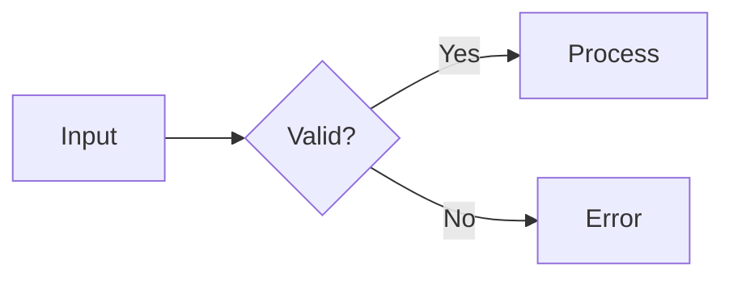

# Claude Style Markdown Preview

A VS Code markdown preview styled after **Claude Code**'s terminal aesthetic — monospace typography, warm orange accents, and a calm dark/light palette. Includes Mermaid diagram rendering and a one-click theme toggle.

> 한국어 README는 [README.ko.md](README.ko.md) 참고.

## Features

- **Monospace everywhere** — uses your editor's font for the entire preview, mirroring Claude Code's terminal feel
- **Theme toggle** — small pill button in the top-right cycles **Auto → Light → Dark**, persisted via `localStorage`
- **Forced themes override VS Code** — pin the preview to light or dark regardless of your editor theme
- **Mermaid diagrams** — local v10.9.1 bundle, no network calls. Supports `flowchart`, `sequenceDiagram`, `classDiagram`, `stateDiagram`, `erDiagram`, `gantt`, `pie`, `journey`, `gitGraph`, `mindmap`, `timeline`, `quadrantChart`, C4, sankey, and more
- **Auto re-render on theme change** — Mermaid SVGs are regenerated to match the new palette
- **Resilient error handling** — invalid Mermaid syntax shows a single inline error box and never pollutes the DOM with stray error SVGs

## Installation

### From VSIX (local distribution)

Download the latest `claude-style-markdown-preview-*.vsix` from the [Releases page](https://github.com/ibank/claude-style-markdown-preview/releases), then:

```bash
code --install-extension claude-style-markdown-preview-*.vsix
```

Or in VS Code: **Extensions** → `⋯` menu → **Install from VSIX...**

### From source (development)

```bash
git clone https://github.com/ibank/claude-style-markdown-preview.git
cd claude-style-markdown-preview

VERSION=$(node -p "require('./package.json').version")
ln -sfn "$(pwd)" "$HOME/.vscode/extensions/ibank.claude-style-markdown-preview-$VERSION"
```

Then **Developer: Reload Window**.

## Usage

1. Open any `.md` file
2. `Cmd+Shift+V` (or `Cmd+K V`) to open the preview
3. Click the toggle in the top-right to switch themes: **◐ Auto → ☀ Light → ☾ Dark**

### Mermaid example

````markdown

````

See [`test.md`](test.md) for a complete sample covering every supported diagram type.

### JavaScript API (preview console)

```js
claudeMdTheme.getMode();           // 'auto' | 'light' | 'dark'
claudeMdTheme.setMode('dark');     // force a mode
claudeMdTheme.getEffectiveTheme(); // 'light' | 'dark'
```

## Customization

All colors are CSS custom properties at the top of [`styles/claude.css`](styles/claude.css):

```css
:root {
  --claude-orange: #d97757;       /* primary accent */
  --claude-orange-soft: #e8a87c;  /* dark-mode links / list markers */
  --claude-orange-deep: #b85a35;  /* light-mode links / list markers */
}

body.vscode-dark        { --md-bg: #1a1a1a; ... }
body.vscode-light       { --md-bg: #faf9f7; ... }
body.claude-force-dark  { ... }   /* applied when toggle = Dark  */
body.claude-force-light { ... }   /* applied when toggle = Light */
```

Edit, save, then refresh the preview (`Cmd+Shift+P` → **Markdown: Refresh Preview**).

## Security

- **Mermaid `securityLevel: 'antiscript'`** — HTML labels in diagrams are allowed, but `<script>` tags and inline event handlers are stripped. This blocks XSS via crafted markdown files while keeping styled labels working.
- **No network calls** — Mermaid is bundled locally; no CDN, no telemetry.
- **No data collection** — only `localStorage` is used, and only for storing the user's theme preference.

If you discover a security issue, please open an issue on the repository.

## How It Works

### Style injection

`contributes.markdown.previewStyles` injects [`styles/claude.css`](styles/claude.css) into the markdown preview webview. It loads after VS Code's defaults, so its rules win on equal specificity.

### Script injection

`contributes.markdown.previewScripts` injects three files into the webview, in this order:

1. **`theme-toggle.js`** — restores saved mode from `localStorage`, mounts the toggle button, and exposes `window.claudeMdTheme`
2. **`mermaid.min.js`** — UMD bundle exposing `globalThis.mermaid`
3. **`mermaid-init.js`** — scans the DOM for diagram blocks, calls `mermaid.parse()` for validation, then `mermaid.render()`

### Mermaid block detection

Two strategies, in order:

1. `pre > code.language-mermaid` — standard markdown-it output
2. Fallback: any `pre > code` whose first non-whitespace line starts with a known Mermaid keyword (`flowchart`, `sequenceDiagram`, etc.) — covers cases where a syntax highlighter rewrites the class

### Render safety

- **`mermaid.parse()` first** — invalid syntax fails fast without `render()`, which prevents Mermaid from leaving stray error SVGs attached to `<body>`
- **`cleanupOrphans()`** — explicit sweep before/after each render cycle removes any orphan render containers Mermaid does manage to leave behind

### Theme switching

Toggle click → body class swap (`claude-force-light` / `claude-force-dark`) → CSS custom properties redefined → entire preview repaints instantly. A `claude-theme-change` event is dispatched, which `mermaid-init.js` listens for and uses to re-render every diagram from its preserved source (stored on `data-mermaid-source` attribute).

### Live edit handling

VS Code rewrites `<body>` contents when the source file changes. A `MutationObserver` re-applies the forced theme class, re-mounts the toggle button if missing, and triggers Mermaid re-rendering for any new blocks.

## Project Structure

```
claude-style-markdown-preview/
├── package.json              # extension manifest
├── README.md                 # this file (English)
├── README.ko.md              # Korean version
├── CHANGELOG.md
├── LICENSE                   # MIT
├── THIRD_PARTY_NOTICES.md    # bundled Mermaid attribution
├── styles/
│   └── claude.css            # all visual styling
├── scripts/
│   ├── theme-toggle.js       # toggle button + forced-theme class management
│   ├── mermaid.min.js        # Mermaid v10.9.1 UMD bundle (~3.2 MB)
│   └── mermaid-init.js       # detect, validate, render, cleanup
└── test.md                   # diagram samples for manual QA
```

## Distribution

### Build a `.vsix`

```bash
npx --yes @vscode/vsce package --no-dependencies
# → claude-style-markdown-preview-<version>.vsix (~1 MB)
```

### Publish to VS Code Marketplace

Requires a registered publisher at https://marketplace.visualstudio.com/manage and an Azure DevOps PAT with **Marketplace → Manage** scope.

```bash
npx vsce login <publisher>
npx vsce publish --no-dependencies
```

### Publish to Open VSX (for VSCodium / Cursor users)

Requires a token from https://open-vsx.org/user-settings/tokens.

```bash
npx ovsx publish --no-dependencies -p <token>
```

## License

[MIT](LICENSE) — © 2026 ibank

Bundled third-party code: see [THIRD_PARTY_NOTICES.md](THIRD_PARTY_NOTICES.md).
