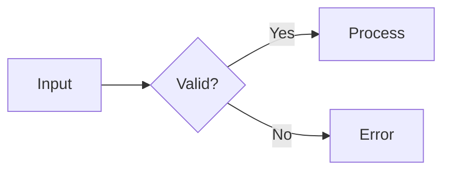

# Claude Style Markdown Preview

VS Code's built-in markdown preview, restyled after Claude: serif headings, a
clean sans-serif body, monospace code, warm orange accents and calibrated light
and dark palettes. It also adds Mermaid diagrams, syntax highlighting,
GitHub-style admonitions and a floating table of contents.

> 한국어 README는 [README.ko.md](README.ko.md) 참고.

## Features

- **Hybrid typography**: Source Serif 4 headings, Source Sans 3 body and
  JetBrains Mono code, with Pretendard (bundled) for Hangul.
- **Auto / Light / Dark**: a segmented control in the top-right. Auto follows
  your VS Code theme, including High Contrast, and your choice is remembered.
- **Syntax highlighting** in a Claude-themed palette for 36 common languages.
  Other languages keep VS Code's own highlighting, recolored to match.
- **Code blocks** get a language label and a Copy button.
- **Mermaid diagrams** (bundled Mermaid 11): flowchart, sequence, class, state,
  ER, Gantt, pie, journey, git graph, mindmap, timeline, quadrant, XY, sankey,
  block, packet, architecture, kanban, C4 and more. Each diagram has zoom,
  Copy SVG and a fullscreen view with drag-to-pan and wheel/pinch zoom.
- **Admonitions**: GitHub-style `> [!NOTE]`, `[!TIP]`, `[!IMPORTANT]`,
  `[!WARNING]` and `[!CAUTION]`, plus `[!DANGER]`.
- **Table of contents**: a floating panel built from `##`–`####` headings that
  highlights the section you're reading.
- **Heading links**: hover a heading and click ¶ to copy its `#section` link.
- **Images**: click to enlarge. An image in a paragraph of its own gets its
  alt text as a caption.
- **Page zoom**: `Cmd/Ctrl` + `+` / `-` / `0`, or `Cmd/Ctrl` + scroll or pinch.
- A reading progress bar, print styles, and support for reduced motion.

## Installation

- **Marketplace**: search for *Claude Style Markdown Preview* in the
  Extensions view, or run
  `code --install-extension ibank.claude-style-markdown-preview`.
- **VSIX**: download `claude-style-markdown-preview-*.vsix` from the
  [Releases page](https://github.com/ibank/claude-style-markdown-preview/releases),
  then run `code --install-extension claude-style-markdown-preview-*.vsix` or
  use **Extensions** → `⋯` → **Install from VSIX...**.

Requires VS Code 1.95 or later. There is nothing to configure: the extension
restyles the built-in preview.

## Usage

1. Open a `.md` file.
2. Open the preview with `Cmd+Shift+V` / `Ctrl+Shift+V`, or to the side with
   `Cmd+K V` / `Ctrl+K V`.
3. Pick a theme with **Auto · Light · Dark** in the top-right corner. The ☰
   button under it opens the table of contents; it appears once a document
   has at least two sections.

### Mermaid

````markdown

```mermaid
flowchart LR
    A[Input] --> B{Valid?}
    B -->|Yes| C[Process]
    B -->|No| D[Error]
```
````

A ` ```mermaid ` block with a syntax error shows the error above its source.
A fence without a language is drawn as a diagram only if its first line is a
Mermaid header (such as `graph TD` or `sequenceDiagram`) and it parses;
otherwise it stays a code block. [`test.md`](test.md) has samples of every
feature.

### JavaScript API

In the preview's developer tools (**Developer: Open Webview Developer
Tools**):

```js
claudeMdTheme.getMode();           // 'auto' | 'light' | 'dark'
claudeMdTheme.setMode('dark');     // force a mode
claudeMdTheme.getEffectiveTheme(); // 'light' | 'dark'
claudeMdZoom.setZoom(1.25);        // 125%
claudeMdZoom.reset();
```

## Customization

Colors are CSS custom properties (`--md-*`). Override them in your own
stylesheet through VS Code's `markdown.styles` setting. That stylesheet loads
after this extension's, and it survives extension updates.

```jsonc
// settings.json
"markdown.styles": [".vscode/preview.css"]
```

```css
/* .vscode/preview.css. data-claude-theme is the theme actually shown. */
body[data-claude-theme="dark"]  { --md-accent: #7aa2f7; --md-link: #7aa2f7; }
body[data-claude-theme="light"] { --md-accent: #3b5bdb; --md-link: #3b5bdb; }
```

Common tokens are `--md-bg`, `--md-text`, `--md-heading`, `--md-accent`,
`--md-link`, `--md-code-bg`, `--md-inline-code-fg` and the syntax colors
`--md-hl-*`. The full list is at the top of
[`styles/claude.css`](styles/claude.css).

## Security and privacy

- Diagrams render with Mermaid's `securityLevel: 'antiscript'`, which strips
  `<script>` tags and event handlers from labels. This runs inside VS Code's
  preview Content Security Policy.
- Mermaid, highlight.js and the Pretendard font are bundled. The Latin fonts
  (Source Sans 3, Source Serif 4, JetBrains Mono) load from Google Fonts. If
  that request is blocked or you are offline, system fonts are used instead.
  There is no telemetry.
- `localStorage` holds only your theme choice and zoom level.

To report a security issue, open an issue on the repository.

## How it works

The extension has no extension-host code. It contributes one stylesheet and
six scripts to VS Code's built-in preview through `markdown.previewStyles` and
`markdown.previewScripts`.

| File | Role |
|---|---|
| `styles/claude.css` | All styling. Theme tokens per VS Code theme class and per forced mode |
| `scripts/theme-toggle.js` | Auto/Light/Dark control, forced-theme classes, `claude-theme-change` event |
| `scripts/page-zoom.js` | Whole-preview zoom (`zoom` on `<body>`) and its badge |
| `scripts/enhance.js` | Heading links, code chrome and highlighting, admonitions, images, TOC, progress bar |
| `scripts/mermaid-init.js` | Finds diagram fences, renders the cards and the fullscreen view |
| `scripts/highlight.min.js` | highlight.js 11.12 (common languages) |
| `scripts/mermaid.min.js` | Mermaid 11.17 (defines the `mermaid` global) |

VS Code loads preview scripts `async`, so none of them relies on another
having run first.

**Live edits.** On each edit VS Code patches the rendered HTML in place with
morphdom, then fires `vscode.markdown.updateContent`. The patch removes this
extension's additions from any element it touches, and both enhancement
scripts put them back synchronously in that event, before the next paint.
Enhancements change VS Code's elements in place rather than wrapping or
replacing them: the code chrome sits inside the `<pre>`, and a diagram card is
its fence's own `<pre>`. That lets the patch keep matching elements one to
one, so open `<details>` stay open and long documents update quickly. Rendered
diagrams are cached by theme and source, so an edit doesn't re-render a
diagram that hasn't changed.

**Theme switching.** The toggle sets `claude-force-light` or
`claude-force-dark` on `<body>`, which redefines the tokens. When the theme
shown changes, whether from the toggle or from VS Code, `theme-toggle.js`
updates `data-claude-theme` and fires `claude-theme-change`, and diagrams are
redrawn in the new theme.

## Project structure

```
claude-style-markdown-preview/
├── package.json              # manifest (contributions only, no `main`)
├── styles/claude.css         # styling and theme tokens
├── scripts/                  # the six preview scripts described above
├── fonts/                    # Pretendard Variable (Hangul)
├── test.md                   # manual QA sample (not packaged)
├── CHANGELOG.md · LICENSE · THIRD_PARTY_NOTICES.md
└── README.md · README.ko.md
```

## Development

Open the folder in VS Code and press `F5` (**Run Extension**). This starts an
Extension Development Host with [`test.md`](test.md) open. After editing a
file, run **Developer: Reload Window** in that host.

Build a `.vsix` (about 3 MB, mostly Mermaid and the Hangul font):

```bash
npx @vscode/vsce package --no-dependencies
```

Pushing a `v*` tag runs [`release.yml`](.github/workflows/release.yml), which
builds the VSIX and attaches it to a GitHub Release. It also publishes to the
VS Code Marketplace and Open VSX when the `VSCE_PAT` and `OVSX_PAT` repository
secrets are set. To publish manually:

```bash
npx @vscode/vsce publish --no-dependencies            # needs a Marketplace PAT
npx ovsx publish --no-dependencies -p <open-vsx-token>
```

## License

[MIT](LICENSE) — © 2026 ibank

Bundled third-party code and fonts: see
[THIRD_PARTY_NOTICES.md](THIRD_PARTY_NOTICES.md).
