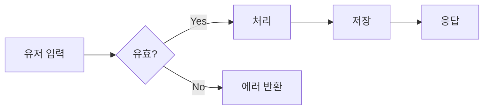
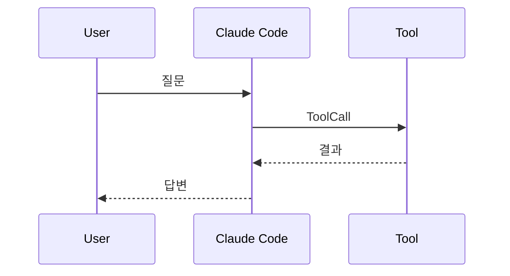
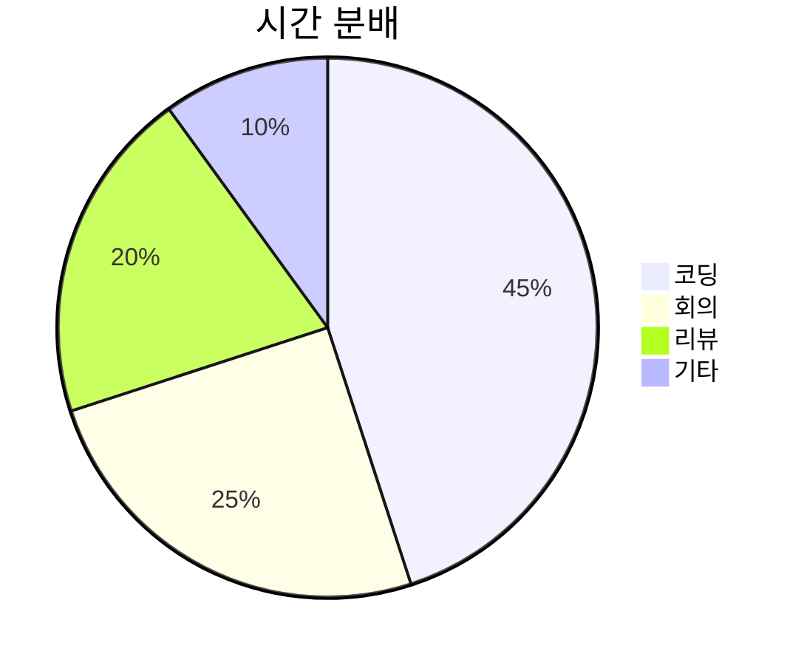

# Claude Style Markdown Preview — v0.2 Test

이 문서는 v0.2의 모든 새 기능을 한 번에 검증하는 샘플입니다. 한글 본문은 **Pretendard**로, 라틴/영어는 **Source Sans 3 + Source Serif 4 + JetBrains Mono**로 렌더되어야 해요.

## Typography

본문 단락은 sans-serif로, *italic*과 **bold**, ~~strikethrough~~ 그리고 인라인 `code` 가 자연스럽게 섞입니다. 헤딩은 serif (Source Serif 4) 입니다. 한 문장 안에서 `inline code` 와 함께 [링크](https://github.com/ibank/claude-style-markdown-preview)도 잘 보이는지 확인.

키 입력: <kbd>Cmd</kbd> + <kbd>Shift</kbd> + <kbd>V</kbd>

### Lists

- 첫 번째 항목
- 두 번째 항목
  - 중첩된 항목
  - 또 하나
- 세 번째 항목

1. 순서가 있는 첫 번째
2. 순서가 있는 두 번째
3. 순서가 있는 세 번째

- [x] 완료된 작업
- [ ] 진행중인 작업
- [ ] 아직 안 한 작업

## Heading anchors

위쪽 헤딩에 마우스를 올려보세요. 우측에 `¶` 기호가 페이드인되고, 클릭하면 deep-link URL이 클립보드에 복사됩니다 ("copied" 라벨이 잠깐 표시됨).

## Code blocks

언어 라벨 + Copy 버튼이 chrome bar로 자동 부착됩니다.

```python
def fibonacci(n: int) -> int:
    """Return the n-th Fibonacci number using memoization."""
    cache = {0: 0, 1: 1}
    def fib(k):
        if k in cache:
            return cache[k]
        cache[k] = fib(k - 1) + fib(k - 2)
        return cache[k]
    return fib(n)

print(fibonacci(20))  # → 6765
```

```typescript
type User = {
  id: string;
  name: string;
  email: string;
};

async function fetchUser(id: string): Promise<User> {
  const res = await fetch(`/api/users/${id}`);
  if (!res.ok) throw new Error(`HTTP ${res.status}`);
  return res.json();
}
```

```bash
# 한글 주석도 잘 보여야 함
git status
git add .
git commit -m "feat: improve markdown preview"
```

언어 지정이 없는 plain code block:

```
이건 plain 블록입니다.
폰트는 모노스페이스 (JetBrains Mono).
한글도 Pretendard로 폴백돼서 깨지지 않아요.
```

## Admonitions

> [!NOTE]
> 일반 정보를 전달할 때 씁니다. 본문보다 살짝 차분한 파란-청록 톤.

> [!TIP]
> 도움이 되는 팁. 녹색 톤으로 표시돼서 한눈에 구분됩니다.
>
> 여러 단락도 자연스럽게 들어가요.

> [!IMPORTANT]
> 중요한 정보. 황색 톤으로 강조되어 무시할 수 없게 합니다.

> [!WARNING]
> 주의가 필요한 상황. Important과 같은 톤이지만 라벨이 다릅니다.

> [!CAUTION]
> 신중해야 하는 작업. 빨간 계열로 명확한 경고.

> [!DANGER]
> 위험. 데이터 손실 가능, 되돌릴 수 없는 작업 등에 사용. 강한 빨강.

일반 blockquote (admonition 마커 없음)은 기존대로 인용 스타일로:

> "디자인은 어떻게 보이느냐가 아니라 어떻게 작동하느냐의 문제다." — Steve Jobs
>
> 두 번째 단락도 같은 인용 안에 들어갑니다.

## Tables

| 컬럼 | 타입 | 설명 |
|---|---|---|
| `id` | `string` | 고유 식별자 (UUID v7) |
| `name` | `string` | 사용자가 입력한 이름 |
| `created_at` | `timestamp` | UTC 기준 생성 시각 |
| `archived` | `boolean` | 아카이브 여부, 기본값 `false` |

행 호버 시 살짝 강조돼야 하고, 헤더는 uppercase로 트랙된 작은 글자입니다.

## Mermaid diagrams (with toolbar)

각 다이어그램 우상단에 zoom in/out, reset, copy SVG, fullscreen 버튼이 있어야 합니다.







### 잘못된 mermaid

문법 오류는 깔끔하게 한 번만 에러로 표시되어야 합니다:

```mermaid
this is not valid mermaid syntax !!!
```

## Images

이미지를 클릭하면 lightbox로 확대됩니다. alt가 있으면 figure caption으로도 표시:


## Reading progress + TOC

- 페이지 최상단에 얇은 오렌지 진행률 바가 있어야 합니다.
- 우상단 햄버거 아이콘을 누르면 floating TOC가 슬라이드인됩니다.
- 스크롤하면 TOC 안의 활성 항목이 자동 갱신됩니다.

## Theme toggle

우상단 segmented pill: **Auto · Light · Dark** 중 클릭하거나 화살표 키로 전환. 선택은 `localStorage`에 저장됩니다.

---

## Long content for scroll testing

### Section A
Lorem ipsum dolor sit amet, consectetur adipiscing elit. 본문이 길어질 때 진행률 바와 TOC active highlight가 부드럽게 따라가는지 확인.

### Section B
Sed do eiusmod tempor incididunt ut labore et dolore magna aliqua. Ut enim ad minim veniam, quis nostrud exercitation.

### Section C
Duis aute irure dolor in reprehenderit in voluptate velit esse cillum dolore eu fugiat nulla pariatur.

### Section D
Excepteur sint occaecat cupidatat non proident, sunt in culpa qui officia deserunt mollit anim id est laborum.

### Section E — 마지막
페이지 끝까지 스크롤하면 진행률 바가 100%에 도달해야 합니다.
