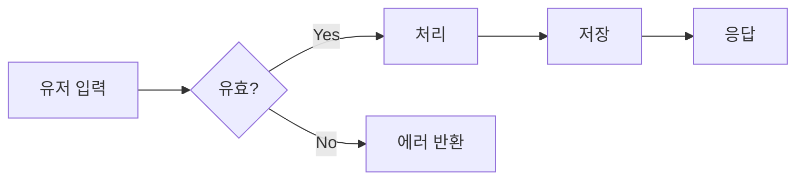
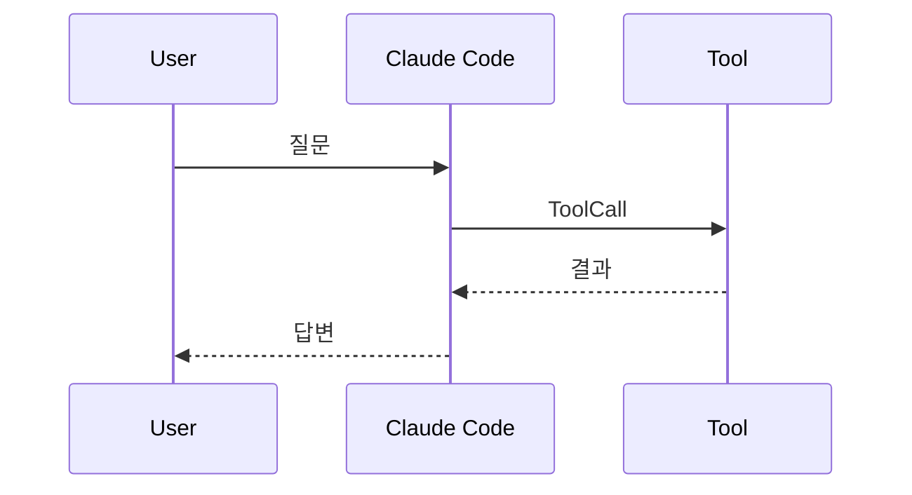
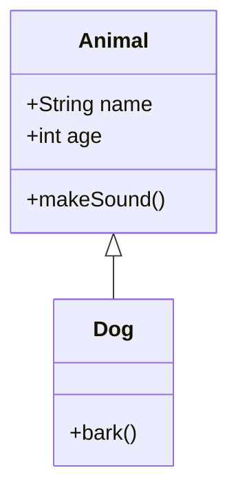
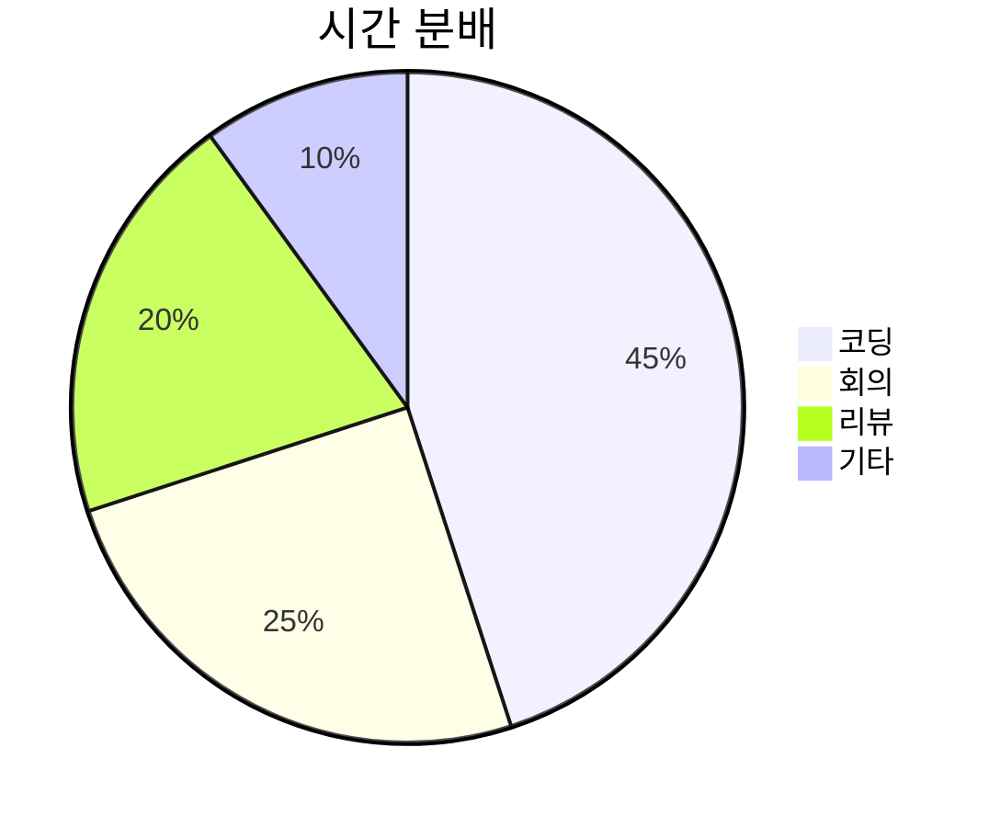

# Claude Markdown Style — Mermaid Test

일반 마크다운과 mermaid 다이어그램이 같이 잘 나오는지 확인.

## Flowchart



## Sequence



## Class



## Pie



## Gantt


## 일반 코드 블록도 영향 없는지

```python
def hello():
    print("이건 그냥 파이썬")
```

## 잘못된 mermaid (에러 표시 확인)

```mermaid
this is not valid mermaid syntax !!!
```
